[toc]


# 概述

地图 JS API 2.0 是高德开放平台免费提供的第四代 Web 地图渲染引擎， 以 WebGL 为主要绘图手段，本着“更轻、更快、更易用”的服务原则，广泛采用了各种前沿技术，交互体验、视觉体验大幅提升，同时提供了众多新增能力和特性

**高德地图使用 Web 墨卡托投影，即采用 EPSG:3857 坐标系统**

**高德地图采用 GCJ-02 坐标系，即火星坐标系**


## 官网

* 官网：https://ditu.amap.com/
* 开放平台：https://lbs.amap.com/
* 文档：https://lbs.amap.com/api/javascript-api-v2/summary
* 示例：https://lbs.amap.com/demo/list/js-api-v2
* 手册：https://lbs.amap.com/api/javascript-api-v2/documentation


<iframe id="doc2" onload="changeHash()" src="https://a.amap.com/jsapi/static/doc/20230922/index.html?v=2" style="font-family: PingFangSC-Regular, &quot;Microsoft YaHei&quot;, &quot;Open Sans&quot;, Arial, &quot;Hiragino Sans GB&quot;, 微软雅黑, STHeiti, &quot;WenQuanYi Micro Hei&quot;, SimSun, sans-serif; box-sizing: border-box; border-top: none; border-right: none; border-bottom: 1px solid rgb(240, 240, 240); border-left: none; border-image: initial; width: 1220px; height: calc(-48px + 100vh); border-radius: 4px; box-shadow: none; margin-bottom: 28px;"></iframe>


# 成为开发者

## 概述

想要使用高德地图，必须先注册成为开发者，获取key

安全密钥机制旨在提升用户对 key 的安全有效管理，降低明文传输被窃取的风险。 2021年12月02日后创建的 key 必须配备安全密钥一起使用


## 步骤

### 第一步：登录高德开放平台控制台

https://console.amap.com/

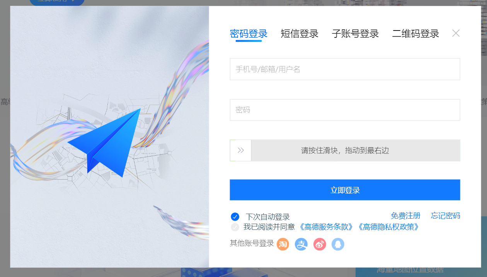


选择登录方式


### 第二步：注册为开发者

登录后显示此界面

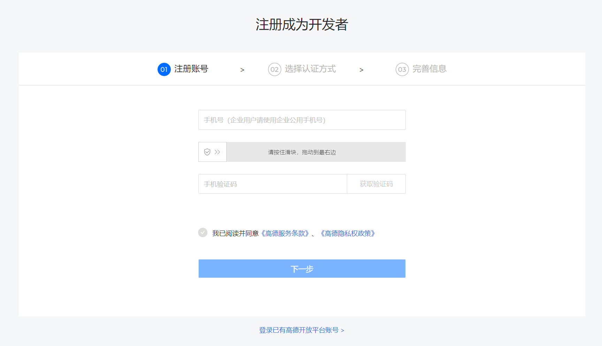


选择认证方式

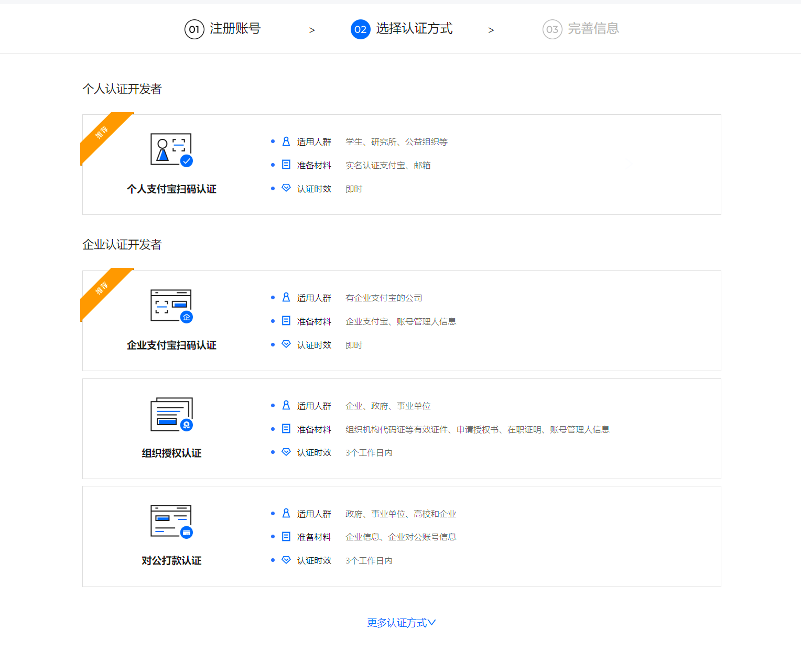


成为个人开发者即可


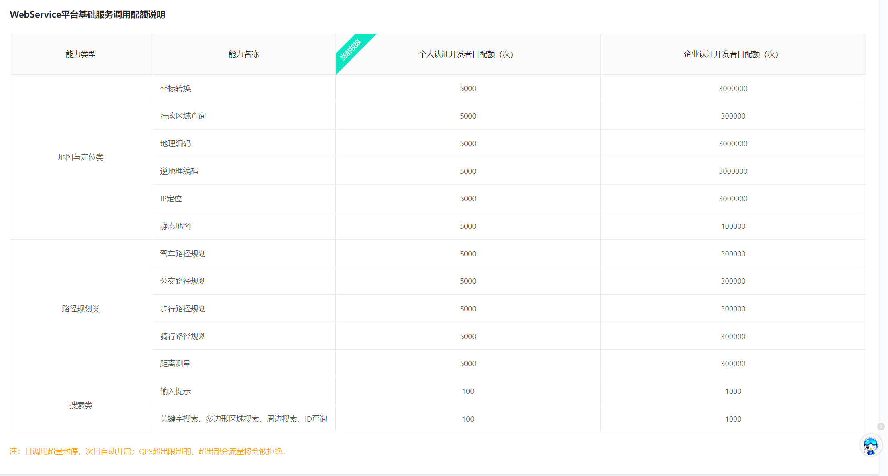


### 第三步：创建key

进入**应用管理**，**创建新应用**

https://console.amap.com/dev/key/app

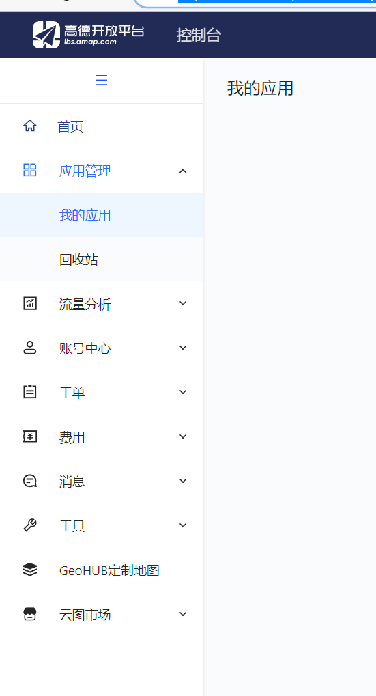


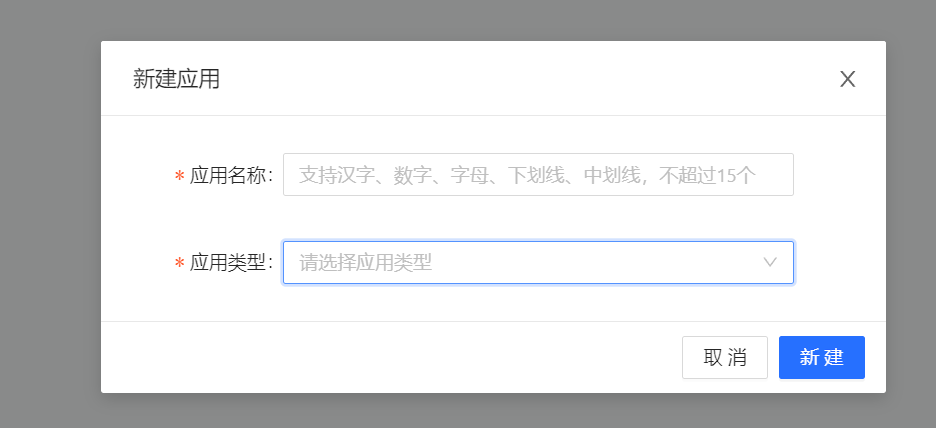


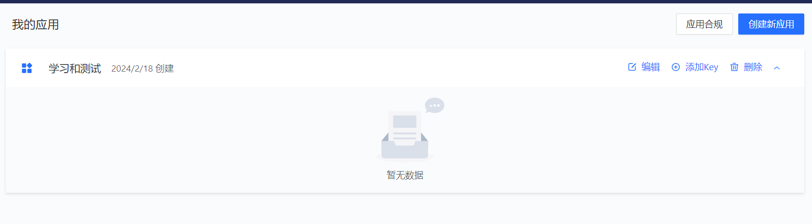


点击添加key

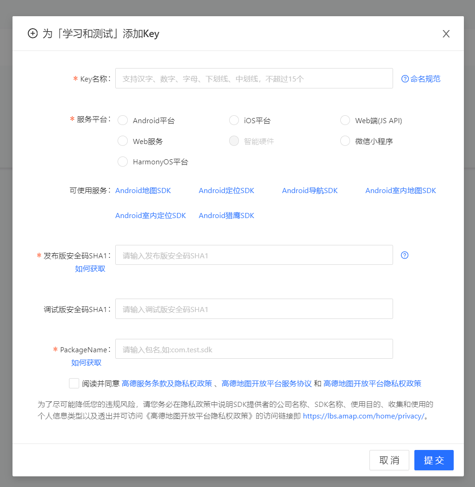


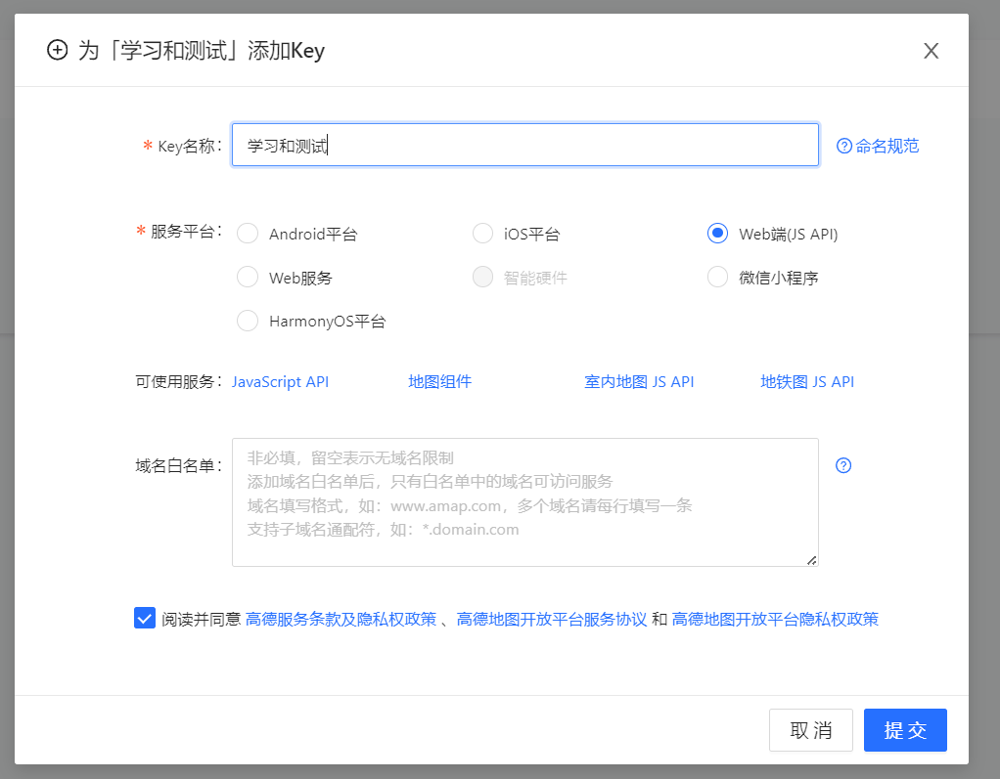


### 第四步：获取key和密钥

创建成功后，可获取 key 和安全密钥

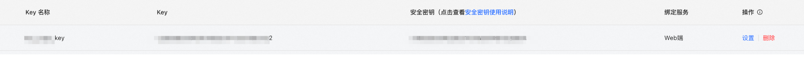


## 流量限制

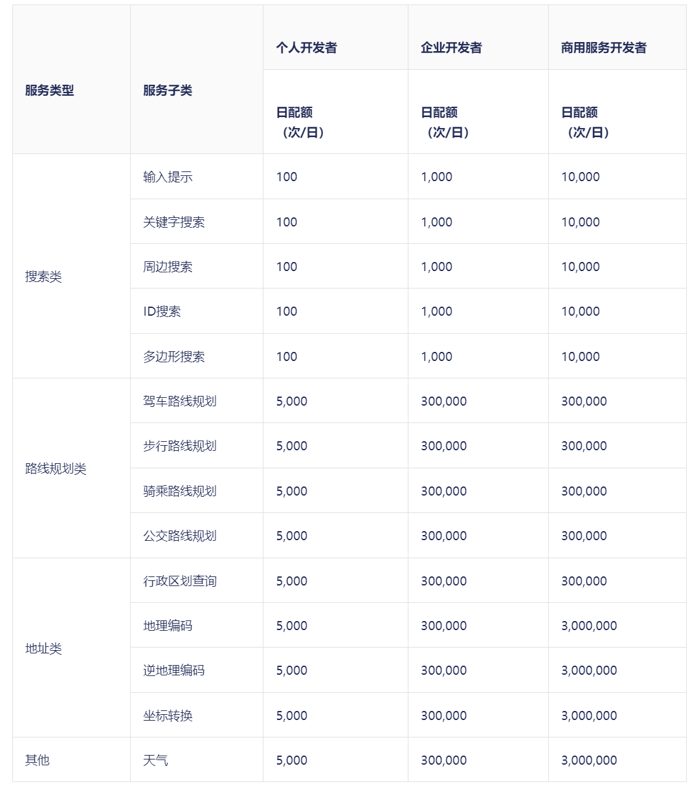


# JS API 安全密钥使用

## 概述

**在2021年12月02日以后申请的 key 需要配合你的安全密钥一起使用**

为了增强安全性，建议将安全密钥存储在服务器端，并通过服务器端生成地图 JS API 的请求 URL。这样可以避免将密钥直接以明文的方式暴露给 Web 端代码中，减少密钥被滥用的风险，如果你只是想便捷开发可以使用明文方式设置

秘钥使用有**代理服务器转发**和**明文方式设置**两种方式


## 通过代理服务器转发

以Nginx反向代理为例，参考以下三个location配置，进行反向代理设置，分别对应自定义地图、海外地图、Web 服务，其中自定义地图和海外地图如果没有使用到相关功能也可以不设置。需要将以下配置中的**「你的安全密钥」**六个字替换为你刚刚获取的securityJsCode安全密钥

```sh
server {
  listen       80;             #nginx端口设置，可按实际端口修改
  server_name  127.0.0.1;      #nginx server_name 对应进行配置，可按实际添加或修改
  # 自定义地图和海外地图如果没有使用到相关功能可以不设置，但是如果需要设置顺序要与示例一致
  # 自定义地图服务代理
  location /_AMapService/v4/map/styles {
    set $args "$args&jscode=你的安全密钥";
    proxy_pass https://webapi.amap.com/v4/map/styles;
  }
  # 海外地图服务代理
  location /_AMapService/v3/vectormap {
    set $args "$args&jscode=你的安全密钥";
    proxy_pass https://fmap01.amap.com/v3/vectormap;
  }
  # Web服务API 代理
  location /_AMapService/ {
    set $args "$args&jscode=你的安全密钥";
    proxy_pass https://restapi.amap.com/;
  }
}
```


JS API 使用`<script>`标签同步加载增加代理服务器设置脚本，设置代理服务器域名或地址，将下面示例代码中的**「你的代理服务器域名或地址」**替换为你的代理服务器域名或 ip 地址，其中_AMapService为代理请求固定前缀，不可省略或修改


脚本同步加载为例：

```html
<div id="container"></div>
<script type="text/javascript">
  window._AMapSecurityConfig = {
    serviceHost: "你的代理服务器域名或地址/_AMapService",
    //例如 ：serviceHost:'http://1.1.1.1:80/_AMapService',
  };
</script>
<script
  type="text/javascript"
  src="https://webapi.amap.com/maps?v=2.0&key=你申请的key值"
></script>
<script type="text/javascript">
  //地图初始化应该在地图容器div已经添加到DOM树之后
  var map = new AMap.Map("container", {
    zoom: 12,
  });
</script>
```


## **通过明文方式设置**

JS API 安全密钥以明文方式设置，不建议在生产环境使用，不安全

JS API 使用`<script>`标签同步加载增加安全密钥设置脚本，并将**「你申请的安全密钥」**替换为你的安全密钥


```html
<div id="container"></div>
<script type="text/javascript">
  window._AMapSecurityConfig = {
    securityJsCode: "「你申请的安全密钥」",
  };
</script>
<script
  type="text/javascript"
  src="https://webapi.amap.com/maps?v=2.0&key=你申请的key值"
></script>
<script type="text/javascript">
  //地图初始化应该在地图容器div已经添加到DOM树之后
  var map = new AMap.Map("container", {
    zoom: 12,
  });
</script>
```


# 入门程序

## 第一步：配置nginx

配置文件如下，需要替换秘钥

```sh
#配置运行Nginx进程生成的worker进程数
worker_processes 2;
#配置Nginx服务器运行对错误日志存放的路径
error_log ./logs/error.log;
#配置Nginx服务器允许时记录Nginx的master进程的PID文件路径和名称
pid ./logs/nginx.pid;
#配置Nginx服务是否以守护进程方法启动
#daemon on;


events{
	#设置Nginx网络连接序列化
	accept_mutex on;
	#设置Nginx的worker进程是否可以同时接收多个请求
	multi_accept on;
	#设置Nginx的worker进程最大的连接数
	worker_connections 1024;
	#设置Nginx使用的事件驱动模型
	#use epoll;
}


http{
	#定义MIME-Type
	include mime.types;
	default_type application/octet-stream;

server {
        listen          8089;
        server_name     localhost;

          # 自定义地图和海外地图如果没有使用到相关功能可以不设置，但是如果需要设置顺序要与示例一致
  # 自定义地图服务代理
  location /_AMapService/v4/map/styles {
    set $args "$args&jscode=你的安全密钥";
    proxy_pass https://webapi.amap.com/v4/map/styles;
  }
  # 海外地图服务代理
  location /_AMapService/v3/vectormap {
    set $args "$args&jscode=你的安全密钥";
    proxy_pass https://fmap01.amap.com/v3/vectormap;
  }
  # Web服务API 代理
  location /_AMapService/ {
    set $args "$args&jscode=你的安全密钥";
    proxy_pass https://restapi.amap.com/;
  }
   }
}
```


## 第二步：检查配置

命令：

```sh
nginx -t
```


```sh
PS D:\opensoft\nginx-1.24.0\conf> cd ..
PS D:\opensoft\nginx-1.24.0> ls


    目录: D:\opensoft\nginx-1.24.0


Mode                 LastWriteTime         Length Name
----                 -------------         ------ ----
d-----         2023/5/17     14:24                cache
d-----         2023/5/12     14:54                conf
d-----         2023/4/11     23:31                contrib
d-----         2023/4/11     23:31                docs
d-----         2023/5/18     14:11                file
d-----          2023/5/3     14:45                html
d-----         2023/5/12     14:54                key
d-----         2023/5/19     14:10                logs
d-----         2023/5/19     13:58                static
d-----         2023/4/29     13:29                temp
-a----         2023/4/11     23:29        3811328 nginx.exe


PS D:\opensoft\nginx-1.24.0> .\nginx.exe -t
nginx: the configuration file D:\opensoft\nginx-1.24.0/conf/nginx.conf syntax is ok
nginx: configuration file D:\opensoft\nginx-1.24.0/conf/nginx.conf test is successful
PS D:\opensoft\nginx-1.24.0>
```


## 第三步：启动

前台启动：

```sh
PS D:\opensoft\nginx-1.24.0> ./nginx
```


## 第四步：HTML页面准备


```html
<!DOCTYPE html>


<html lang="en">
<head>
    <meta charset="UTF-8">
    <title>高德地图入门程序</title>
    <style>
        html,
        body,
        #container {
            width: 100%;
            height: 100%;
        }
    </style>
</head>
<body>
<div id="container"></div>
</body>

<script>

    window._AMapSecurityConfig = {
        serviceHost: 'http://127.0.0.1:8089/_AMapService',
    };

</script>

<script
        type="text/javascript"
        src="https://webapi.amap.com/maps?v=2.0&key=318d115b92dd7beb6e26260a2e208256"
></script>

<script>
    //地图初始化应该在地图容器div已经添加到DOM树之后
    var map = new AMap.Map("container", {
        zoom: 12,
    });
</script>
</html>
```


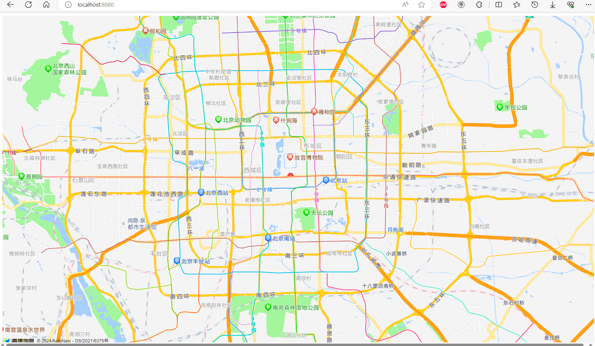


另一种写法：

```html
<script type="text/javascript">
  window._AMapSecurityConfig = {
    securityJsCode: "「你申请的安全密钥」",
  };
</script>
<script src="https://webapi.amap.com/loader.js"></script>
<script type="text/javascript">
  AMapLoader.load({
    key: "「你申请的应用Key」", //申请好的Web端开发者 Key，调用 load 时必填
    version: "2.0", //指定要加载的 JS API 的版本，缺省时默认为 1.4.15
  })
    .then((AMap) => {
      const map = new AMap.Map("container");
    })
    .catch((e) => {
      console.error(e); //加载错误提示
    });
</script>
```


## 第五步：添加标记点Marker

```html
<!DOCTYPE html>


<html lang="en">
<head>
    <meta charset="UTF-8">
    <title>高德地图入门程序</title>
    <style>
        html,
        body,
        #container {
            width: 100%;
            height: 100%;
        }
    </style>
</head>
<body>
<div id="container"></div>
</body>

<script>

    window._AMapSecurityConfig = {
        serviceHost: 'http://127.0.0.1:8089/_AMapService',
    };

</script>

<script
        type="text/javascript"
        src="https://webapi.amap.com/maps?v=2.0&key=318d115b92dd7beb6e26260a2e208256"
></script>

<script>
    //地图初始化应该在地图容器div已经添加到DOM树之后
    var map = new AMap.Map("container", {
        zoom: 12,
    });

    const marker =new AMap.Marker({
        position:[116.25789,39.2456]
    })
    map.add(marker);
    const marker2 =new AMap.Marker({
        position:[112.58756,23.57865]
    })
    map.add(marker2);

</script>
</html>
```


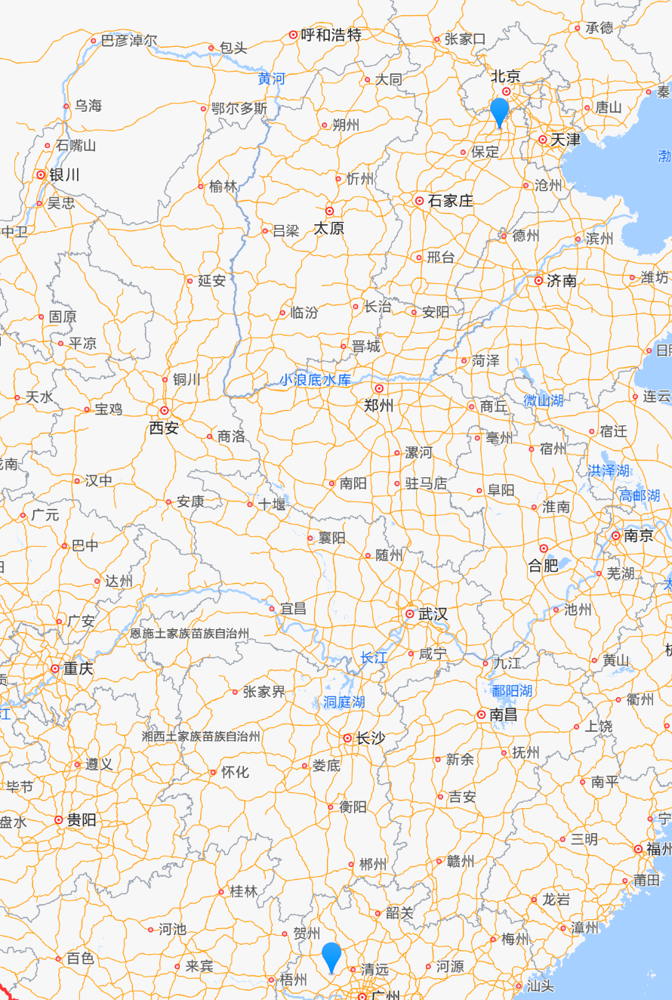


## 第六步：添加折线

```html
<!DOCTYPE html>


<html lang="en">
<head>
    <meta charset="UTF-8">
    <title>高德地图入门程序</title>
    <style>
        html,
        body,
        #container {
            width: 100%;
            height: 100%;
        }
    </style>
</head>
<body>
<div id="container"></div>
</body>

<script>

    window._AMapSecurityConfig = {
        serviceHost: 'http://127.0.0.1:8089/_AMapService',
    };

</script>

<script
        type="text/javascript"
        src="https://webapi.amap.com/maps?v=2.0&key=318d115b92dd7beb6e26260a2e208256"
></script>

<script>
    //地图初始化应该在地图容器div已经添加到DOM树之后
    var map = new AMap.Map("container", {
        zoom: 12,
    });

    const marker = new AMap.Marker({
        position: [116.25789, 39.2456]
    })
    map.add(marker);
    const marker2 = new AMap.Marker({
        position: [112.58756, 23.57865]
    })
    map.add(marker2);

    const line = [[115.2578, 26.2568], [115.257, 33.2586], [114.257, 39.25777], [112.258, 26.255465]];
    const polyline = new AMap.Polyline({
        path: line, //设置线覆盖物路径
        strokeColor: "#3366FF", //线颜色
        strokeWeight: 5, //线宽
        strokeStyle: "solid", //线样式
    });
    map.add(polyline);

</script>
</html>

```


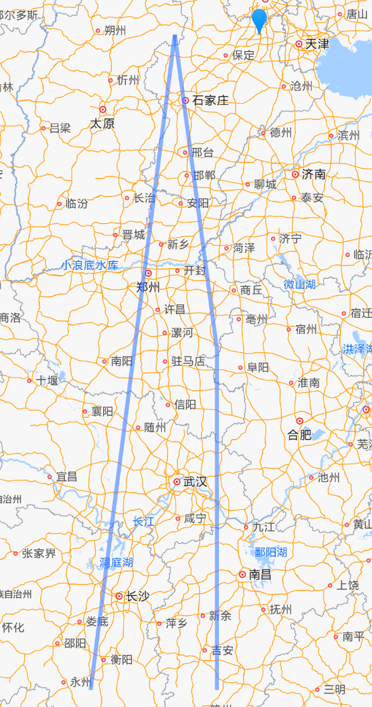


# 整合vue

## vue2


### 第一步：创建项目

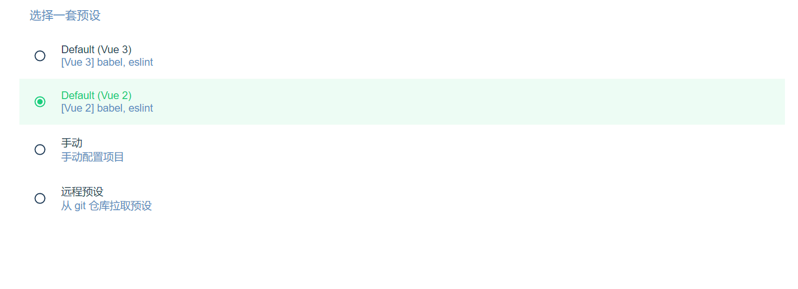


### 第二步：安装依赖

```sh
npm i @amap/amap-jsapi-loader --save
```


```sh
PS D:\程序\2024Q1\vue-integration-amap> npm i @amap/amap-jsapi-loader --save
npm WARN optional SKIPPING OPTIONAL DEPENDENCY: fsevents@2.3.3 (node_modules\fsevents):
npm WARN notsup SKIPPING OPTIONAL DEPENDENCY: Unsupported platform for fsevents@2.3.3: wanted {"os":"darwin","arch":"any"} (current: {"os":"win32","arch":"x64"})

+ @amap/amap-jsapi-loader@1.0.1
added 1 package from 1 contributor and audited 971 packages in 3.294s

95 packages are looking for funding
  run `npm fund` for details

found 2 moderate severity vulnerabilities
  run `npm audit fix` to fix them, or `npm audit` for details
PS D:\程序\2024Q1\vue-integration-amap>
```


可以看到package.json多了一项：

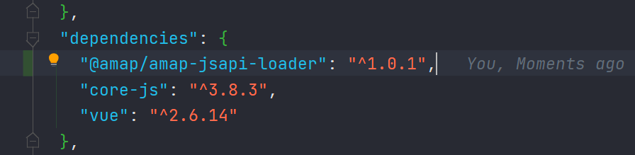


### 第三步：新建文件

在sr/view目录下新建一个vue文件

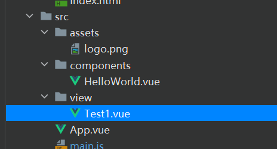


### 第四步：创建地图容器

```vue
<template>
    <div id="container"></div>
</template>

<script>
export default {
    
}
</script>

<style scoped>

</style>

```


### 第五步：设置样式

```vue
<template>
    <div id="container"></div>
</template>

<script>
export default {
    
}
</script>

<style scoped>
#container {
    padding: 0px;
    margin: 0px;
    width: 100%;
    height: 800px;
}
</style>

```


### 第六步：导入依赖

```vue
<template>
    <div id="container"></div>
</template>

<script>
import AMapLoader from '@amap/amap-jsapi-loader';

export default {

}
</script>

<style scoped>
#container {
    padding: 0px;
    margin: 0px;
    width: 100%;
    height: 800px;
}
</style>

```


### 第七步：完善代码

```vue
<template>
    <div id="container"></div>
</template>

<script>
import AMapLoader from '@amap/amap-jsapi-loader';

export default {
    mounted()
    {
        window._AMapSecurityConfig = {
            serviceHost: `http://127.0.0.1:8089/_AMapService`
        }
        this.initAMap();
    },
    unmounted()
    {
        this.map?.destroy();
    },
    methods:
        {
            /**
             * 初始化高德地图
             */
            initAMap()
            {
                AMapLoader.load({
                    key: "318d115b92dd7beb6e26260a2e208256", // 申请好的Web端开发者Key，首次调用 load 时必填
                    version: "2.0", // 指定要加载的 JSAPI 的版本，缺省时默认为 1.4.15
                    // 需要使用的的插件列表，如比例尺'AMap.Scale'等
                    plugin: [
                        'AMap.Autocomplete', // 输入提示插件
                        'AMap.PlaceSearch', // POI搜索插件
                        'AMap.Scale', // 右下角缩略图插件 比例尺
                        'AMap.OverView', // 地图鹰眼插件
                        'AMap.ToolBar', // 地图工具条
                        'AMap.Geolocation', // 定位控件，用来获取和展示用户主机所在的经纬度位置
                        'AMap.MarkerClusterer',
                        'AMap.Geocoder'
                    ],
                })
                    .then((AMap) =>
                    {
                        this.map = new AMap.Map("container", {
                            // 设置地图容器id
                            viewMode: "3D", // 是否为3D地图模式
                            zoom: 12, // 初始化地图级别
                            center: [111.397428, 23.90923], // 初始化地图中心点位置
                        });
                    })
                    .catch((e) =>
                    {
                        console.log(e);
                    });
            },
        },
}
</script>

<style scoped>
#container {
    padding: 0px;
    margin: 0px;
    width: 100%;
    height: 800px;
}
</style>

```


### 第八步：添加点

```vue
<template>
    <div>
        <div id="container"></div>
        <div>
            <button @click="addPoint">添加点</button>
            <button @click="clear">清空</button>
        </div>
    </div>
</template>

<script>
import AMapLoader from '@amap/amap-jsapi-loader';

export default {
    mounted()
    {
        window._AMapSecurityConfig = {
            serviceHost: `http://127.0.0.1:8089/_AMapService`
        }
        this.initAMap();
    },
    unmounted()
    {
        this.map?.destroy();
    },
    methods:
        {
            /**
             * 初始化高德地图
             */
            initAMap()
            {
                AMapLoader.load({
                    key: "318d115b92dd7beb6e26260a2e208256", // 申请好的Web端开发者Key，首次调用 load 时必填
                    version: "2.0", // 指定要加载的 JSAPI 的版本，缺省时默认为 1.4.15
                    // 需要使用的的插件列表，如比例尺'AMap.Scale'等
                    plugin: [
                        'AMap.Autocomplete', // 输入提示插件
                        'AMap.PlaceSearch', // POI搜索插件
                        'AMap.Scale', // 右下角缩略图插件 比例尺
                        'AMap.OverView', // 地图鹰眼插件
                        'AMap.ToolBar', // 地图工具条
                        'AMap.Geolocation', // 定位控件，用来获取和展示用户主机所在的经纬度位置
                        'AMap.MarkerClusterer',
                        'AMap.Geocoder'
                    ],
                })
                    .then((AMap) =>
                    {
                        this.map = new AMap.Map("container", {
                            // 设置地图容器id
                            viewMode: "3D", // 是否为3D地图模式
                            zoom: 12, // 初始化地图级别
                            center: [111.397428, 23.90923], // 初始化地图中心点位置
                        });
                    })
                    .catch((e) =>
                    {
                        console.log(e);
                    });
            },
            addPoint()
            {
                const marker = new AMap.Marker({
                    position: [100 + Math.random() * 22, 22 + Math.random() * 20]
                })
                this.map.add(marker);
            },
            clear()
            {
                this.map.clearMap();
            }
        },
}
</script>

<style scoped>
#container {
    padding: 0px;
    margin: 0px;
    width: 100%;
    height: 800px;
}
</style>

```


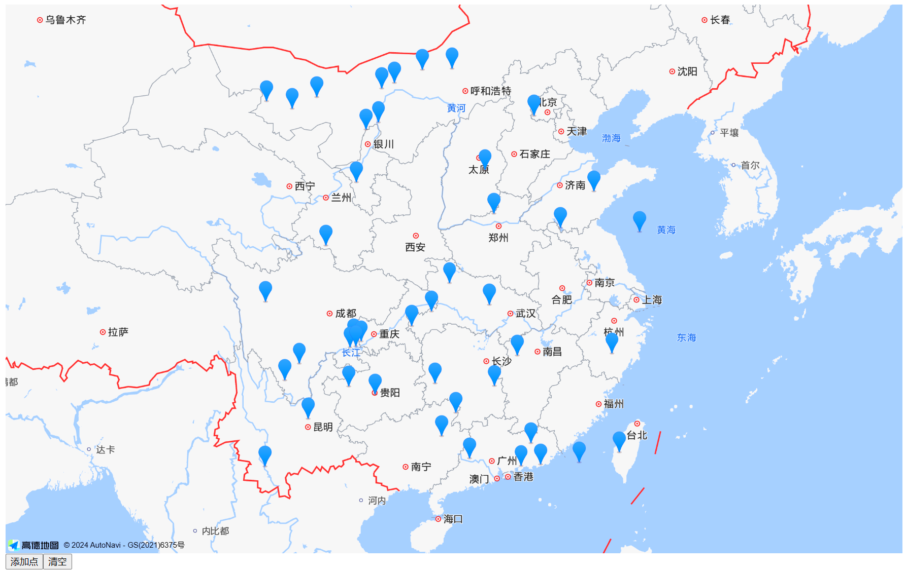


## vue3


### 第一步：创建项目

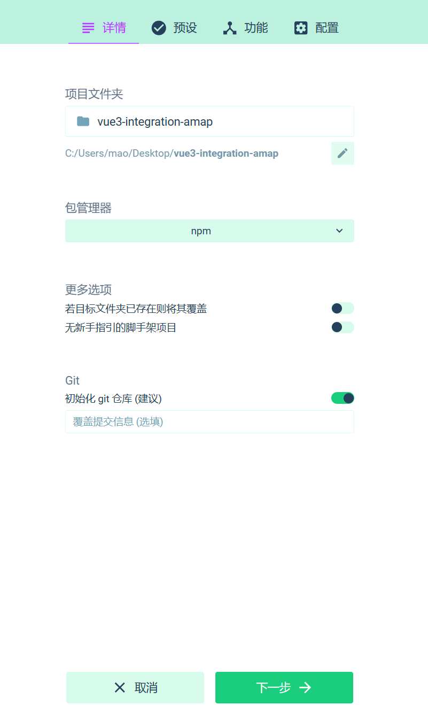


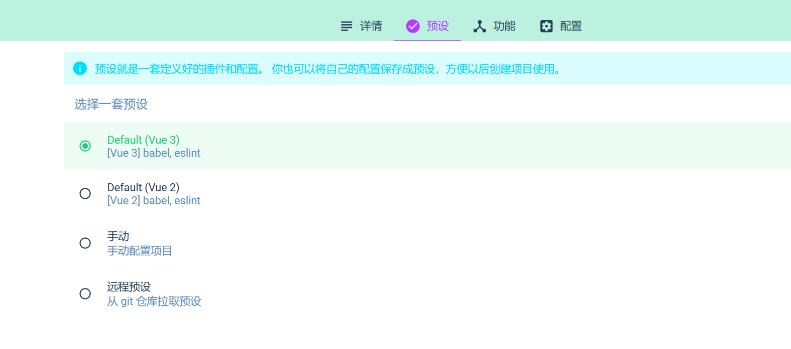


### 第二步：安装依赖

```sh
npm i @amap/amap-jsapi-loader --save
```


```sh

```


### 第三步：新建文件

在sr/view目录下新建一个vue文件


### 第四步：创建地图容器

```vue
<template>
    <div id="container"></div>
</template>

<script setup>

</script>

<style scoped>

</style>

```


### 第五步：设置样式

```vue
<template>
    <div id="container"></div>
</template>

<script setup>

</script>

<style scoped>
#container {
    padding: 0px;
    margin: 0px;
    width: 100%;
    height: 800px;
}
</style>

```


### 第六步：导入依赖

```vue
<template>
    <div id="container"></div>
</template>

<script setup>
import AMapLoader from '@amap/amap-jsapi-loader';

</script>

<style scoped>
#container {
    padding: 0px;
    margin: 0px;
    width: 100%;
    height: 800px;
}
</style>

```


### 第七步：完善代码

```vue
<template>
    <div id="container"></div>
</template>

<script setup>
import AMapLoader from '@amap/amap-jsapi-loader';
import {onBeforeMount, onMounted, onUnmounted} from 'vue'

onBeforeMount(()=>
{
    window._AMapSecurityConfig = {
        serviceHost: `http://127.0.0.1:8089/_AMapService`
    }
})

onMounted(()=>
{
    initAMap();
})

onUnmounted(()=>
{
    this.map?.destroy();
})

/**
 * 初始化高德地图
 */
function initAMap()
{
    AMapLoader.load({
        key: "318d115b92dd7beb6e26260a2e208256", // 申请好的Web端开发者Key，首次调用 load 时必填
        version: "2.0", // 指定要加载的 JSAPI 的版本，缺省时默认为 1.4.15
        // 需要使用的的插件列表，如比例尺'AMap.Scale'等
        plugin: [
            'AMap.Autocomplete', // 输入提示插件
            'AMap.PlaceSearch', // POI搜索插件
            'AMap.Scale', // 右下角缩略图插件 比例尺
            'AMap.OverView', // 地图鹰眼插件
            'AMap.ToolBar', // 地图工具条
            'AMap.Geolocation', // 定位控件，用来获取和展示用户主机所在的经纬度位置
            'AMap.MarkerClusterer',
            'AMap.Geocoder'
        ],
    })
        .then((AMap) =>
        {
            this.map = new AMap.Map("container", {
                // 设置地图容器id
                viewMode: "3D", // 是否为3D地图模式
                zoom: 12, // 初始化地图级别
                center: [111.397428, 23.90923], // 初始化地图中心点位置
            });
        })
        .catch((e) =>
        {
            console.log(e);
        });
}

</script>

<style scoped>
#container {
    padding: 0px;
    margin: 0px;
    width: 100%;
    height: 800px;
}
</style>

```


## 封装

在src/utils下创建`amapUtils.ts`

```typescript
import AMapLoader from '@amap/amap-jsapi-loader';


const defaultPlugin: Array<string> = [
    'AMap.Autocomplete', // 输入提示插件
    'AMap.PlaceSearch', // POI搜索插件
    'AMap.Scale', // 右下角缩略图插件 比例尺
    'AMap.OverView', // 地图鹰眼插件
    'AMap.ToolBar', // 地图工具条
    'AMap.Geolocation', // 定位控件，用来获取和展示用户主机所在的经纬度位置
    'AMap.MarkerClusterer',
    'AMap.Geocoder'
];

/**
 * 初始化地图
 * @param that vue视图的this指针
 * @param pluginList 插件列表
 * @param param 参数
 * @param key 高德地图的key
 */
export function initAMap(that: any, pluginList: Array<string>, param: object, key: string): any
{
    window._AMapSecurityConfig = {
        serviceHost: `http://127.0.0.1:8089/_AMapService`
    }
    const plugin = pluginList ? pluginList : defaultPlugin
    AMapLoader.load({
        key: key ? key : "318d115b92dd7beb6e26260a2e208256", // 申请好的Web端开发者Key，首次调用 load 时必填
        version: "2.0", // 指定要加载的 JSAPI 的版本，缺省时默认为 1.4.15
        // 需要使用的的插件列表，如比例尺'AMap.Scale'等
        plugin: plugin,
    })
        .then((AMap: any) =>
        {
            const params = param ? param : {
                // 设置地图容器id
                viewMode: "3D", // 是否为3D地图模式
                zoom: 12, // 初始化地图级别
                center: [111.397428, 23.90923], // 初始化地图中心点位置
            }
            const map = new AMap.Map("container", params);
            that.map = map;
        })
        .catch((e: Error) =>
        {
            console.log('加载失败：', e);
        });
}

/**
 * 销毁地图
 * @param map 高德地图容器对象
 */
export function destroy(map: any): void
{
    map?.destroy();
}

```


在src目录下创建`env.d.ts`

```typescript
declare module "@amap/amap-jsapi-loader";
```


在src目录下创建`global.d.ts`

```typescript

// src/global.d.ts
export {}

declare global {
    interface Window {
        _AMapSecurityConfig: any;
    }
}

declare const window: any;

```


使用示例：

```vue
<template>
    <div id="container"></div>
</template>

<script>
import {initAMap, destroy} from '../utils/amapUtils'

export default {
    name: "View1",
    data()
    {
        return {
            map: null,
        }
    },
    methods: {},
    created()
    {
        console.log("初始化")
        initAMap(this);
    },
    beforeDestroy()
    {
        console.log("销毁")
        destroy(this.map)
    },
}
</script>

<style scoped>
#container {
    padding: 0px;
    margin: 0px;
    width: 100%;
    height: 90vh;
}
</style>

```


# 入门

## 图层

### 概述

JS API 支持官方图层、三方图层、数据图层等

实时交通路况图层`AMap.TileLayer.Traffic`


1. 标准图层 [TileLayer](https://lbs.amap.com/api/jsapi-v2/documentation#tilelayer)
2. 卫星图层 [TileLayer.Satellite](https://lbs.amap.com/api/jsapi-v2/documentation#Satellite)
3. 路网图层 [TileLayer.RoadNet](https://lbs.amap.com/api/jsapi-v2/documentation#RoadNet)
4. 实时交通图层 [TileLayer.Traffic](https://lbs.amap.com/api/jsapi-v2/documentation#Traffic)
5. 楼块图层 [Buildings](https://lbs.amap.com/api/jsapi-v2/documentation#buildings)
6. 室内图层 [IndoorMap](https://lbs.amap.com/api/jsapi-v2/documentation#indoormap)


### 使用

创建图层

```js
const layer = new AMap.createDefaultLayer({
  zooms: [3, 20], //可见级别
  visible: true, //是否可见
  opacity: 1, //透明度
  zIndex: 0, //叠加层级
});
```


加载图层

```js
const map = new AMap.Map("container", {
  viewMode: "2D", //默认使用 2D 模式
  zoom: 11, //地图级别
  center: [116.397428, 39.90923], //地图中心点
  layers: [layer], //layer为创建的默认图层
});
```


```vue
<template>
    <div>
        <div id="container"></div>
        <button @click="addLayer">加载图层</button>
    </div>
</template>

<script>
import {initAMap, destroy} from '../utils/amapUtils'

export default {
    name: "View2",
    data()
    {
        return {
            map: null,
        }
    },
    methods: {
        addLayer()
        {
            const layer = new AMap.createDefaultLayer({
                zooms: [3, 20], //可见级别
                visible: true, //是否可见
                opacity: 1, //透明度
                zIndex: 0, //叠加层级
            });
            this.map.setLayers(layer);
        },
    },
    created()
    {
        console.log("初始化")
        initAMap(this);
    },
    beforeDestroy()
    {
        console.log("销毁")
        destroy(this.map)
    },
}
</script>

<style scoped>
#container {
    padding: 0px;
    margin: 0px;
    width: 100%;
    height: 90vh;
}
</style>

```


### **实时交通路况图层**

**AMap.TileLayer.Traffic**

| **参数/方法** | **说明**     | **类型** | **参数值描述**           | **默认值** |
| ------------- | ------------ | -------- | ------------------------ | ---------- |
| autoRefresh   | 是否自动刷新 | Boolean  | true \| false            | false      |
| interval      | 刷新间隔     | Number   | 自动更新数据间隔的毫秒数 | 180        |


添加图层使用map.add(traffic)，移除路况图层：map.remove(traffic)


```vue
<template>
    <div>
        <div id="container"></div>
        <button @click="addLayer">加载图层</button>
        <button @click="addTraffic">创建实时交通路况图层</button>
        <button @click="showTraffic">显示路况图层</button>
        <button @click="hideTraffic">隐藏路况图层</button>
    </div>
</template>

<script>
import {initAMap, destroy} from '../utils/amapUtils'

export default {
    name: "View2",
    data()
    {
        return {
            map: null,
            traffic: null,
        }
    },
    methods: {
        addLayer()
        {
            const layer = new AMap.createDefaultLayer({
                zooms: [3, 20], //可见级别
                visible: true, //是否可见
                opacity: 1, //透明度
                zIndex: 0, //叠加层级
            });
            this.map.setLayers(layer);
        },
        addTraffic()
        {
            if (this.traffic)
            {
                return;
            }
            const traffic = new AMap.TileLayer.Traffic({
                autoRefresh: true, //是否自动刷新，默认为false
                interval: 60, //刷新间隔，默认180s
            });
            this.traffic = traffic;
            this.map.add(traffic);
        },
        showTraffic()
        {
            if (this.traffic)
            {
                this.traffic.show();
            }
        },
        hideTraffic()
        {
            if (this.traffic)
            {
                this.traffic.hide();
            }
        }
    },
    created()
    {
        console.log("初始化")
        initAMap(this);
    },
    beforeDestroy()
    {
        console.log("销毁")
        destroy(this.map)
    },
}
</script>

<style scoped>
#container {
    padding: 0px;
    margin: 0px;
    width: 100%;
    height: 90vh;
}
</style>
```


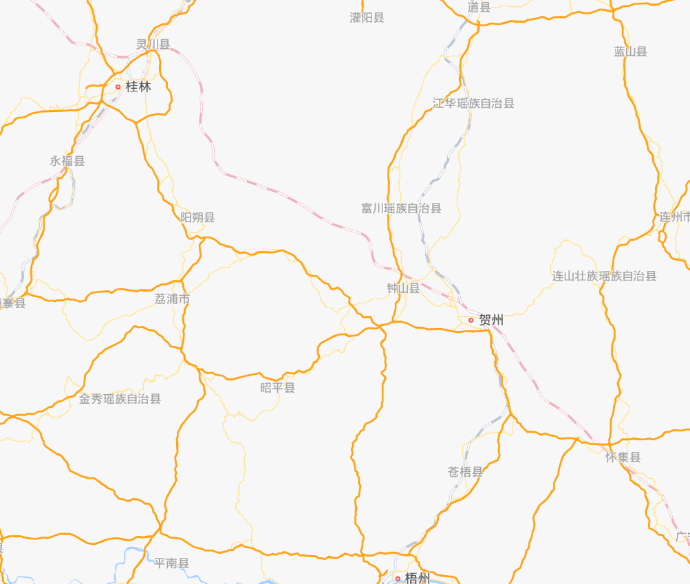


显示后：

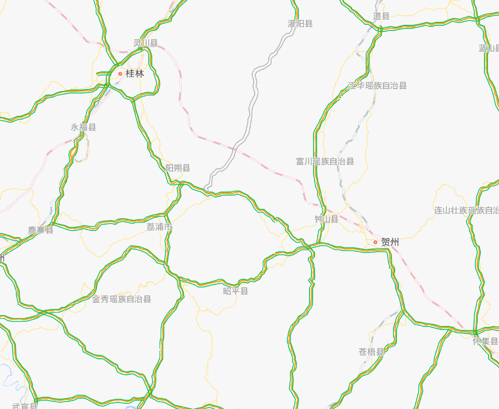


### 卫星与路网图层

```vue
<template>
    <div>
        <div id="container"></div>
        <button @click="addTraffic">创建卫星与路网图层</button>
        <button @click="showTraffic">显示图层</button>
        <button @click="hideTraffic">隐藏图层</button>
    </div>
</template>

<script>
import {initAMap, destroy} from '../utils/amapUtils'

export default {
    name: "View3",
    data()
    {
        return {
            map: null,
            traffic: null,
        }
    },
    methods: {
        addTraffic()
        {
            if (this.traffic)
            {
                return;
            }
            const traffic = new AMap.TileLayer.Satellite();
            //创建路网图层
            var roadNet = new AMap.TileLayer.RoadNet();
            this.traffic = traffic;
            this.map.setLayers([traffic, roadNet]);
        },
        showTraffic()
        {
            if (this.traffic)
            {
                this.traffic.show();
            }
        },
        hideTraffic()
        {
            if (this.traffic)
            {
                this.traffic.hide();
            }
        }
    },
    created()
    {
        console.log("初始化")
        initAMap(this);
    },
    beforeDestroy()
    {
        console.log("销毁")
        destroy(this.map)
    },
}
</script>

<style scoped>
#container {
    padding: 0px;
    margin: 0px;
    width: 100%;
    height: 90vh;
}
</style>

```


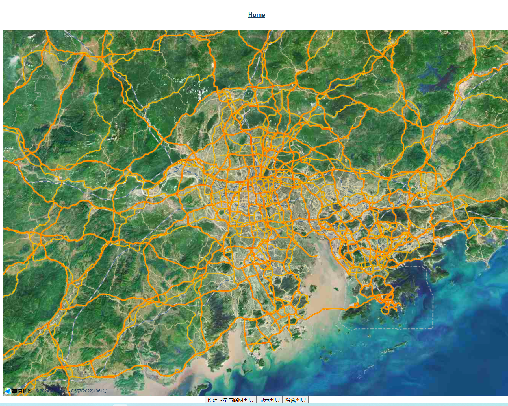


### 楼块图层

楼块图层用于展示矢量建筑物，与标准图层中的楼块要素的效果相同。二者区别在于，楼块图层可以用来实现一些特殊的效果，如 3D 视图下为楼块指定高度比例系数heightFactor

楼块图层的有效缩放级别范围为[ 17, 20 ]

创建楼块图层需要在初始化地图的时候设置showBuildingBlock: false属性，此属性会展示默认的楼块图层，此时再创建楼块图层会存在两个楼块图层


```vue
<template>
    <div>
        <div id="container"></div>
        <button @click="addTraffic">创建楼块图层</button>
        <button @click="showTraffic">显示楼块图层</button>
        <button @click="hideTraffic">隐藏楼块图层</button>
    </div>
</template>

<script>
import {initAMap, destroy} from '../utils/amapUtils'

export default {
    name: "View4",
    data()
    {
        return {
            map: null,
            traffic: null,
        }
    },
    methods: {
        addTraffic()
        {
            if (this.traffic)
            {
                return;
            }
            const traffic =  new AMap.Buildings({
                zooms: [17, 20],
                zIndex: 10,
                heightFactor: 2, //2倍于默认高度（3D 视图下生效）
            });
            this.traffic = traffic;
            this.map.add(traffic);
        },
        showTraffic()
        {
            if (this.traffic)
            {
                this.traffic.show();
            }
        },
        hideTraffic()
        {
            if (this.traffic)
            {
                this.traffic.hide();
            }
        }
    },
    created()
    {
        console.log("初始化")
        initAMap(this,undefined,{
            center: [116.397428, 39.90923], //地图中心点
            viewMode: "3D", //地图模式
            pitch: 60, //俯仰角度
            rotation: -35, //地图顺时针旋转角度
            zoom: 17, //地图级别
            showBuildingBlock: false,
        });
    },
    beforeDestroy()
    {
        console.log("销毁")
        destroy(this.map)
    },
}
</script>

<style scoped>
#container {
    padding: 0px;
    margin: 0px;
    width: 100%;
    height: 88vh;
}
</style>

```


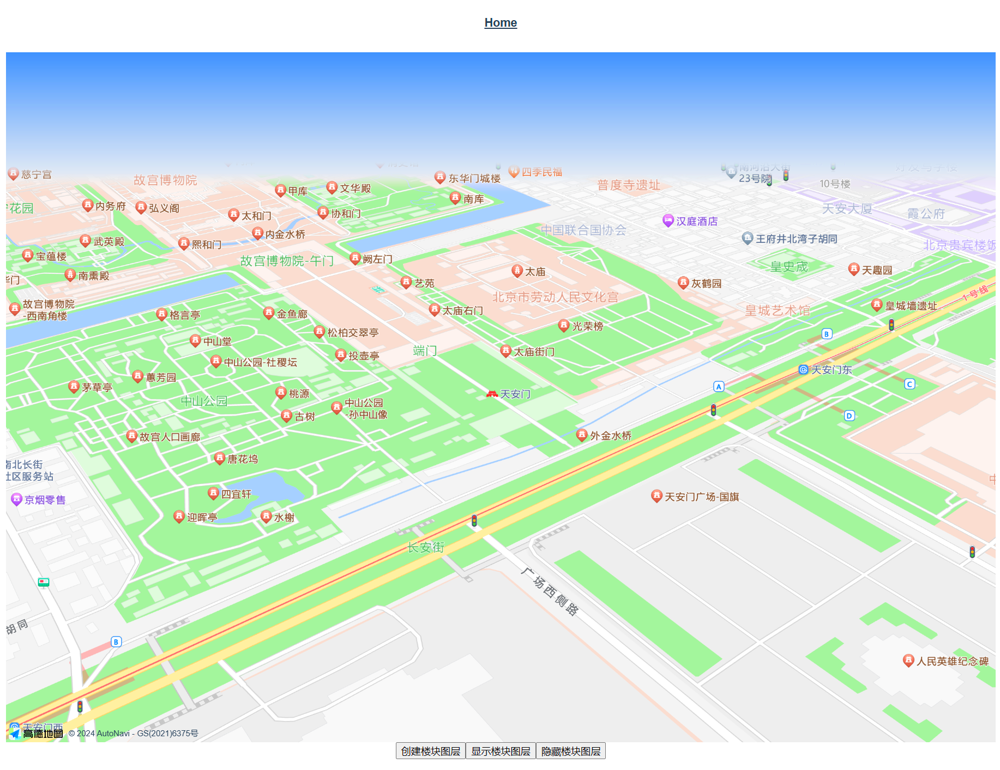


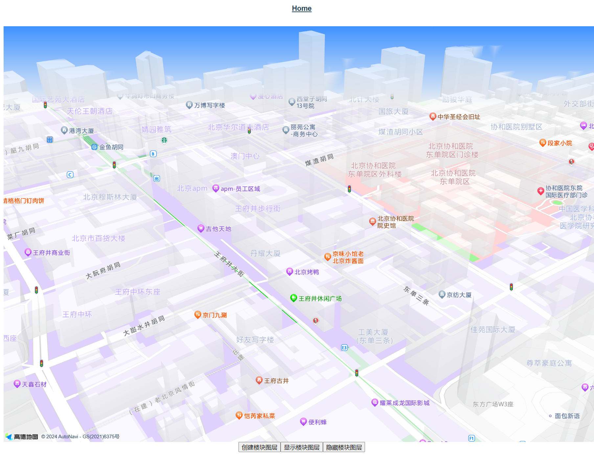


## 地图控件

### 概述

JS API 提供了众多的控件，需要引入之后才能使用这些控件的功能

| **缩放控件** AMap.ToolBar地图的放大和缩小 | **比例尺控件** AMap.Scale显示当前地图的比例尺 | **控制罗盘控件** AMap.ControlBar控制地图旋转和倾斜 |
| ------------------------------------------------------------ | ------------------------------------------------------------ | ------------------------------------------------------------ |
|                                                              |                                                              |                                                              |
| **定位控件**AMap.Geolocation提供定位功能 | **鹰眼控件** AMap.HawkEye地图缩略图，标记当前展示区域 | 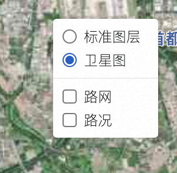**图层切换控件** AMap.MapType切换不同的地图类型 |


### **插件列表**

| **类名**               | **类功能说明**                                               | **相应教程**                                                 | **属性及方法说明**                                           |
| ---------------------- | ------------------------------------------------------------ | ------------------------------------------------------------ | ------------------------------------------------------------ |
| AMap.ElasticMarker     | 灵活点标记，可以随着地图级别改变样式和大小的 Marker          | [灵活点标记](https://lbs.amap.com/api/javascript-api-v2/guide/amap-marker/elasticmarker) | [AMap.ElasticMarker](https://lbs.amap.com/api/javascript-api-v2/documentation#elasticmarker) |
| AMap.ToolBar           | 工具条，控制地图的缩放、平移等                               | [添加地图控件](https://lbs.amap.com/api/javascript-api-v2/tutorails/add-plugin) | [AMap.ToolBar](https://lbs.amap.com/api/javascript-api-v2/documentation#toolbar) |
| AMap.Scale             | 比例尺，显示当前地图中心的比例尺                             | [AMap.Scale](https://lbs.amap.com/api/javascript-api-v2/documentation#scale) |                                                              |
| AMap.HawkEye           | 鹰眼，用于显示缩略地图，显示于地图右下角，可以随主图的视口变化而变化 | [AMap.HawkEye](https://lbs.amap.com/api/javascript-api-v2/documentation#hawkeye) |                                                              |
| AMap.ControlBar        | 组合了旋转、倾斜、复位在内的地图控件                         | [添加地图控件](https://lbs.amap.com/api/javascript-api-v2/tutorails/add-plugin) | [AMap.ControlBar](https://lbs.amap.com/api/javascript-api-v2/documentation#controlbar) |
| AMap.MapType           | 图层切换，通过该插件可以进行地图切换                         | [JS API ](https://lbs.amap.com/demo/jsapi-v2/example/map-lifecycle/loader)[加载器](https://lbs.amap.com/demo/jsapi-v2/example/map-lifecycle/loader) | [AMap.MapType](https://lbs.amap.com/api/javascript-api-v2/documentation#maptype) |
| AMap.Geolocation       | 浏览器定位，提供了获取用户当前准确位置、所在城市的方法       | [定位](https://lbs.amap.com/api/javascript-api-v2/guide/services/geolocation) | [AMap.Geolocation](https://lbs.amap.com/api/javascript-api-v2/documentation#geolocation) |
| AMap.AutoComplete      | 输入提示，提供了根据关键字获得提示信息的功能                 | [输入提示与POI搜索](https://lbs.amap.com/api/javascript-api-v2/guide/services/autocomplete) | [AMap.AutoComplete](https://lbs.amap.com/api/javascript-api-v2/documentation#autocomplete) |
| AMap.PlaceSearch       | 地点搜索服务，提供了关键字搜索、周边搜索、范围内搜索等功能   | [AMap.PlaceSearch](https://lbs.amap.com/api/javascript-api-v2/documentation#placesearch) |                                                              |
| AMap.DistrictSearch    | 行政区查询服务，提供了根据名称关键字、citycode、adcode 来查询行政区信息的功能 | [行政区查询](https://lbs.amap.com/api/javascript-api-v2/guide/services/district-search) | [AMap.DistrictSearch](https://lbs.amap.com/api/javascript-api-v2/documentation#districtsearch) |
| AMap.LineSearch        | 公交路线服务，提供公交路线相关信息查询服务                   | [公交线路与站点查询](https://lbs.amap.com/api/javascript-api-v2/guide/services/bus) | [AMap.LineSearch](https://lbs.amap.com/api/javascript-api-v2/documentation#linesearch) |
| AMap.StationSearch     | 公交站点查询服务，提供途经公交线路、站点位置等信息           | [AMap.StationSearch](https://lbs.amap.com/api/javascript-api-v2/documentation#stationsearch) |                                                              |
| AMap.Driving           | 驾车路线规划服务，提供按照起、终点进行驾车路线的功能         | [路线规划](https://lbs.amap.com/api/javascript-api-v2/guide/services/navigation) | [AMap.Driving](https://lbs.amap.com/api/javascript-api-v2/documentation#driving) |
| AMap.TruckDriving      | 货车路线规划，提供起、终点坐标的驾车导航路线查询功能         | [AMap.TruckDriving](https://lbs.amap.com/api/javascript-api-v2/documentation#truckdriving) |                                                              |
| AMap.Transfer          | 公交路线规划服务，提供按照起、终点进行公交路线的功能         | [AMap.Transfer](https://lbs.amap.com/api/javascript-api-v2/documentation#transfer) |                                                              |
| AMap.Walking           | 步行路线规划服务，提供按照起、终点进行步行路线的功能         | [AMap.Walking](https://lbs.amap.com/api/javascript-api-v2/documentation#walking) |                                                              |
| AMap.Riding            | 骑行路线规划服务，提供按照起、终点进行骑行路线的功能         | [AMap.Riding](https://lbs.amap.com/api/javascript-api-v2/documentation#riding) |                                                              |
| AMap.DragRoute         | 拖拽导航插件，可拖拽起终点、途经点重新进行路线规划           | [AMap.DragRoute](https://lbs.amap.com/api/javascript-api-v2/documentation#dragroute) |                                                              |
| AMap.Geocoder          | 地理编码与逆地理编码服务，提供地址与坐标间的相互转换         | [地理编码与逆地理编码](https://lbs.amap.com/api/javascript-api-v2/guide/services/geocoder) | [AMap.Geocoder](https://lbs.amap.com/api/javascript-api-v2/documentation#geocoder) |
| AMap.CitySearch        | 城市获取服务，获取用户所在城市信息或根据给定IP参数查询城市信息 | [定位](https://lbs.amap.com/api/javascript-api-v2/guide/services/geolocation) | [AMap.CitySearch](https://lbs.amap.com/api/javascript-api-v2/documentation#citysearch) |
| AMap.IndoorMap         | 室内地图，用于在地图中显示室内地图                           | [叠加室内地图](https://lbs.amap.com/demo/jsapi-v2/example/indoormap/add-indoormap) | [AMap.IndoorMap](https://lbs.amap.com/api/javascript-api-v2/documentation#indoormap) |
| AMap.MouseTool         | 鼠标工具插件，用于鼠标画标记点、线、多边形、矩形、圆、距离量测、面积量测、拉框放大、拉框缩小等功能 | [绘制矢量图形](https://lbs.amap.com/api/javascript-api-v2/guide/services/mouse-tool) | [AMap.MouseTool](https://lbs.amap.com/api/javascript-api-v2/documentation#mousetool) |
| AMap.CircleEditor      | 圆编辑插件，用于使用鼠标改变圆半径大小、拖拽圆心改变圆的位置 | [圆的绘制](https://lbs.amap.com/demo/jsapi-v2/example/overlayers/circle-draw-and-edit) | [AMap.CircleEditor](https://lbs.amap.com/api/javascript-api-v2/documentation#circleeditor) |
| AMap.PolygonEditor     | 多边形编辑插件，用于通过鼠标调整多边形形状                   | [面编辑](https://lbs.amap.com/api/javascript-api-v2/guide/amap-polygon/polygonEditor) | [AMap.PolygonEditor](https://lbs.amap.com/api/javascript-api-v2/documentation#polygoneditor) |
| AMap.PolylineEditor    | 折线编辑器，用于通过鼠标调整折线的形状                       | [折线编辑](https://lbs.amap.com/api/javascript-api-v2/guide/amap-line/line-editor) | [AMap.PolylineEditor](https://lbs.amap.com/api/javascript-api-v2/documentation#polylineeditor) |
| AMap.RectangleEditor   | 矩形编辑器，用于通过鼠标调整矩形形状。                       | [矩形编辑](https://lbs.amap.com/demo/javascript-api/example/overlayers/rectangle-draw-and-edit) | [AMap.RectangleEditor](https://lbs.amap.com/api/javascript-api-v2/documentation#rectangleeditor) |
| AMap.EllipseEditor     | 椭圆编辑器，用于通过鼠标调整椭圆形状。                       | [椭圆编辑](https://lbs.amap.com/demo/javascript-api/example/overlayers/ellipse-draw-and-edit) | [AMap.EllipseEditor](https://lbs.amap.com/api/javascript-api-v2/documentation#ellipseeditor) |
| AMap.BezierCurveEditor | 贝塞尔曲线编辑器，用于通过鼠标调整贝塞尔曲线形状。           | [贝塞尔曲线编辑](https://lbs.amap.com/api/javascript-api-v2/guide/amap-line/beziercurve-editor) | [AMap.BezierCurveEditor](https://lbs.amap.com/api/javascript-api-v2/documentation#beziercurveeditor) |
| AMap.MarkerCluster     | 点聚合插件，用于展示大量点标记，将点标记按照距离进行聚合，以提高绘制性能 | [点聚合](https://lbs.amap.com/api/javascript-api-v2/guide/amap-massmarker/marker-cluster) | [AMap.MarkerCluster](https://lbs.amap.com/api/javascript-api-v2/documentation#markercluster) |
| AMap.RangingTool       | 测距插件，可以用距离或面积测量                               | [测距工具](https://lbs.amap.com/demo/jsapi-v2/example/mouse-operate-map/measure-distance) | [AMap.RangingTool](https://lbs.amap.com/api/javascript-api-v2/documentation#rangingtool) |
| AMap.CloudDataSearch   | 云图搜索服务，根据关键字搜索云图点信息                       |                                                              | [AMap.CloudDataSearch](https://lbs.amap.com/api/javascript-api-v2/documentation#clouddatasearch) |
| AMap.Weather           | 天气预报插件，用于获取未来的天气信息                         | [天气](https://lbs.amap.com/api/javascript-api-v2/guide/services/weather) | [AMap.Weather](https://lbs.amap.com/api/javascript-api-v2/documentation#weather) |
| AMap.HeatMap           | 热力图插件（暂时不支持移动端，建议使用 [Loca 热力图](https://lbs.amap.com/demo/loca-v2/demos/cat-heatmap/heatmap-diff)） |                                                              | [AMap.HeatMap](https://lbs.amap.com/api/javascript-api-v2/documentation#heatmap) |


### 引入地图控件

```js
//异步加载控件
AMap.plugin('AMap.ToolBar',function(){ 
  var toolbar = new AMap.ToolBar(); //缩放工具条实例化
  map.addControl(toolbar);
});
```


控制地图控件

```js
toolbar.show(); //缩放工具展示
toolbar.hide(); //缩放工具隐藏
```


### 使用

```vue
<template>
    <div>
        <div id="container"></div>
        <button @click="addItem1">添加工具条</button>
        <button @click="showItem(0)">显示工具条</button>
        <button @click="hideItem(0)">隐藏工具条</button>
        <button @click="addItem2">添加比例尺</button>
        <button @click="showItem(1)">显示比例尺</button>
        <button @click="hideItem(1)">隐藏比例尺</button>
        <button @click="addItem3">添加鹰眼</button>
        <button @click="showItem(2)">显示鹰眼</button>
        <button @click="hideItem(2)">隐藏鹰眼</button>
        <button @click="addItem4">添加控制控件</button>
        <button @click="showItem(3)">显示控制控件</button>
        <button @click="hideItem(3)">隐藏控制控件</button>

    </div>
</template>

<script>
import {initAMap, destroy} from '../utils/amapUtils'

export default {
    name: "View1",
    data()
    {
        return {
            map: null,
            itemList: {
                item1: null,
                item2: null,
                item3: null,
                item4: null,
            }
        }
    },
    methods: {
        addItem1()
        {
            if (this.itemList.item1)
            {
                return;
            }
            AMap.plugin('AMap.ToolBar', () =>
            {
                this.itemList.item1 = new AMap.ToolBar();
                this.map.addControl(this.itemList.item1);
            });
        },
        addItem2()
        {
            if (this.itemList.item2)
            {
                return;
            }
            AMap.plugin('AMap.Scale', () =>
            {
                this.itemList.item2 = new AMap.Scale();
                this.map.addControl(this.itemList.item2);
            });
        },
        addItem3()
        {
            if (this.itemList.item3)
            {
                return;
            }
            AMap.plugin('AMap.HawkEye', () =>
            {
                this.itemList.item3 = new AMap.HawkEye();
                this.map.addControl(this.itemList.item3);
            });
        },
        addItem4()
        {
            if (this.itemList.item4)
            {
                return;
            }
            AMap.plugin('AMap.ControlBar', () =>
            {
                this.itemList.item4 = new AMap.ControlBar();
                this.map.addControl(this.itemList.item4);
            });
        },

        showItem(index)
        {
            const key = Object.keys(this.itemList)[index];
            this.itemList[key].show();
        },
        hideItem(index)
        {
            const key = Object.keys(this.itemList)[index];
            this.itemList[key].hide();
        }
    },
    created()
    {
        console.log("初始化")
        initAMap(this);
    },
    beforeDestroy()
    {
        console.log("销毁")
        destroy(this.map)
    },

}
</script>

<style scoped>
#container {
    padding: 0px;
    margin: 0px;
    width: 100%;
    height: 88vh;
}
</style>
```


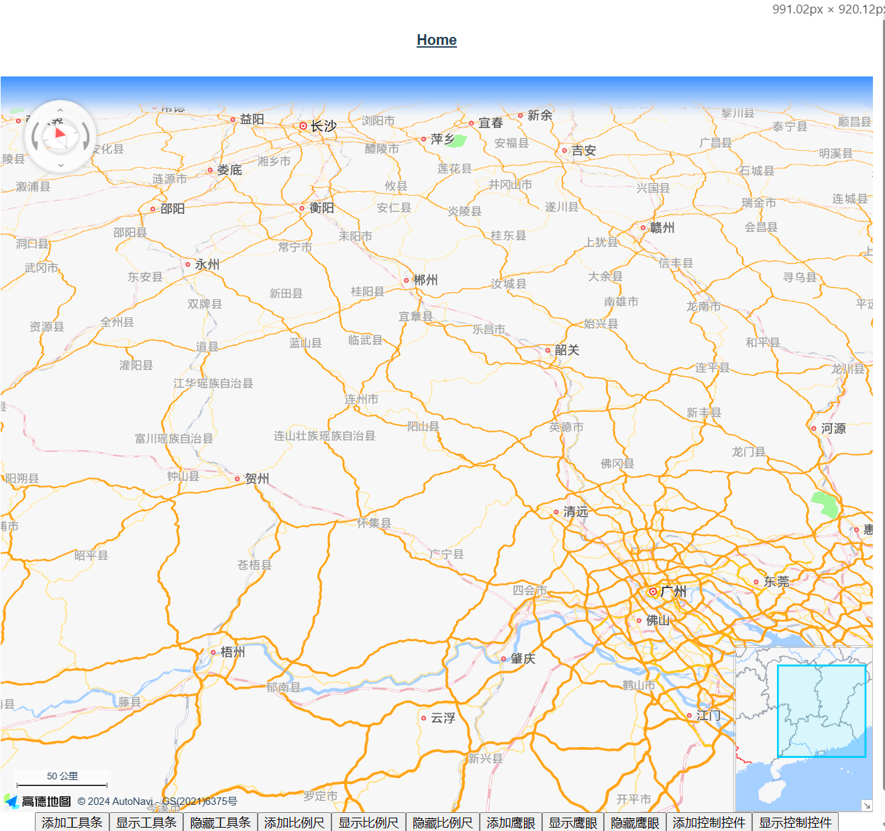


# 地图组成和常用名词

## 地图组成

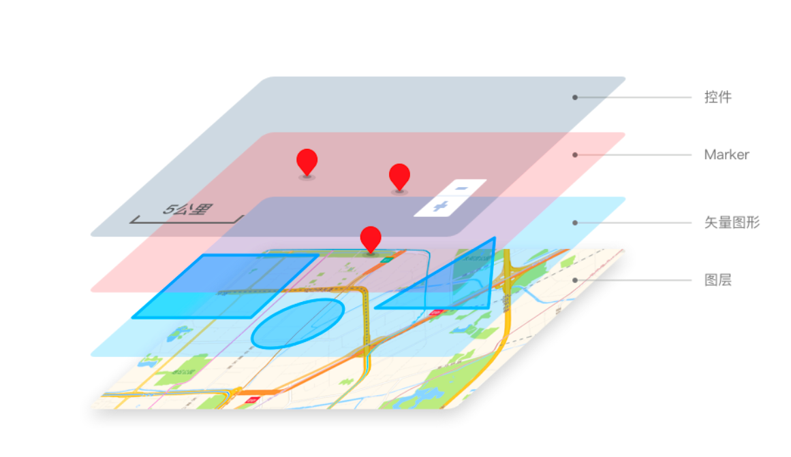


使用高德地图 JS API 创建的地图通常由这几部分组成：

* 地图容器 Container
* 图层 Layers
* 矢量图形 Vector Overlays
* 点标记 Markers
* 地图控件 Map Controls


### **地图容器 Container**

即在准备阶段所创建的指定了 id 的`<div>`对象，这个`<div>`将作为承载所有图层、点标记、矢量图形、控件的容器


### **图层 Layers**

图层是指能够在视觉上覆盖一定地图范围，用来描述全部或者部分现实世界区域内的地图要素的抽象概念，一幅地图通常由一个或者多个图层组成。如上图中处于整个地图容器最下方的二维矢量图层和实施交通图层。


### **矢量图形 Vector Overlays**

矢量图形，一般覆盖于底图图层之上，通过矢量的方式(路径或者实际大小)来描述其形状，用几何的方式来展示真实的地图要素，会随着地图缩放而发生视觉大小的变化，但其代表的实际路径或范围不变，如上图中红框内的折线、圆、多边形等

除了图中的折线、圆、多边形之外，JS API 还提供了矩形、椭圆、贝瑟尔曲线等常用的矢量图形。3D 视图下的立面体等可以看做是一些特殊的矢量图形


### **点标记 Markers**

点标记是用来标示某个位置点信息的一种地图要素，覆盖于图层之上。如图中蓝色方框中的两个点状要素。其在屏幕上的位置会随着地图的缩放和中心变化而发生改变，但是会与图层内的要素保持相对静止


### **地图控件 Map Controls**

控件浮在所有图层和地图要素之上，用于满足一定的交互或提示功能。一般相对于地图容器静止，不随着地图缩放和中心变化而发生位置的变化。如上图中绿色方框中的比例尺和级别控件


## 常用名词

### **插件 Plugins**

插件是独立于 JS API 地图核心模块之外的一些功能，比如服务类、绘制工具、矢量图形编辑工具、点聚合、热力图等


### **地图级别 ZoomLevel**

级别与地图的比例尺成正比，每增大一级，地图的比例尺也增大一倍，地图显示的越详细。Web地图的最小级别通常为3级，最大级别各家略有不同，高德地图 JS API 目前最大级别为 **20** 级


### **经纬度 LngLat**

坐标通常指经纬度坐标，高德地图的坐标范围大致为：东西经 180 度（[-180, 180]，西半球为负，东半球为正），南北纬 85 度（[-85, 85]，北半球为正，南半球为负


### **底图 BaseLayer**

严格意义上，底图指处于所有图层和图形最下方的一个图层，通常不透明。可以是单一图层，比如官方标准图层，也可以是图层组合，比图卫星图层和路网图层组合


### **地图要素 Map Features**

严格意义的地图要素指的是展示在地图上的地理要素，包括道路、区域面、建筑、POI 标注、路名等。开发者自定义的点标记、矢量图形也可以看做是一种地图要素


### **标注 Labels**

我们习惯将底图上自带的标示一定信息的文字或图标称为标注，比如 POI 标注，道路名称标注等


### **地图平面像素坐标 Plane Coordinates**

地图平面像素坐标指投影为平面之后的地图上的平面像素坐标，高德地图使用的Web墨卡托投影，在 3 级时，平面坐标范围为横纵[0, 256*2^3]像素，每级别扩大一倍，即第 n 级的平面坐标范围为 [0, -256*2^n]像素


### **投影 Projection**

地图投影指的是将地球球面的经纬度坐标映射到地图平面坐标的变换和映射关系


# 基础类

## 概述

使用 JS API 开发之前有几个基础类型需要了解一下，包括：

1. 经纬度AMap.LngLat 
2. 像素点AMap.Pixel
3. 像素尺寸 AMap.Size
4. 经纬度矩形边界 AMap.Bounds


## 经纬度

### 概述

经纬度（**AMap.LngLat**）是利用三维球面空间来描述地球上一个位置的坐标系统，每个经纬度坐标由经度 lng 和纬度 lat 两个分量组成。在 JS API 里使用经纬度来表示地图的中心点center、点标记的位置position、圆的中心点center、折线和多边形的路径path等，以及其他所有表述实际位置的地方

**经纬度的有效范围为 [-180, 180]，纬度大约为 [-85, 85]**


### 使用

```js
var position = new AMap.LngLat(116, 39);//标准写法
var position = [116, 39]; //简写
var map = new AMap.Center('conatiner',{
  center:position
})
```


```js
var path = [new AMap.LngLat(116,39), new AMap.LngLat(116,40), new AMap.LngLat(117,39)] //标准写法
var path = [ [116,39], [116,40], [117,39] ]; //简写
var polyline = new AMap.Polyline({
  path : path,
})
map.add(polyline);
```


```vue
<template>
    <div>
        <div id="container"></div>
        <button @click="addPoint1">添加点1</button>
        <button @click="addPoint2">添加点2</button>
    </div>
</template>

<script>
import {initAMap, destroy} from '../utils/amapUtils'

export default {
    name: "View1",
    data()
    {
        return {
            map: null,
        }
    },
    methods: {
        addPoint1()
        {
            const marker = new AMap.Marker({
                title: '标记点1',
                position: new AMap.LngLat(113.34, 23.6532),
            })
            this.map.add(marker)
        },
        addPoint2()
        {
            const marker = new AMap.Marker({
                title: '标记点1',
                position: [114.45, 23.765]
            })
            this.map.add(marker)
        },

    },
    created()
    {
        console.log("初始化")
        initAMap(this);
    },
    beforeDestroy()
    {
        console.log("销毁")
        destroy(this.map)
    },
}
</script>

<style scoped>
#container {
    padding: 0px;
    margin: 0px;
    width: 100%;
    height: 90vh;
}
</style>
```


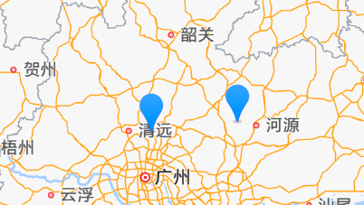


使用经纬度类型可以进行一些简单的位置计算，比如点与点、点与线的距离，根据距离差计算另一个经纬度等


```js
var lnglat1 = new AMap.LngLat(116, 39);
var lnglat2 = new AMap.LngLat(117, 39);
var distance = lnglat1.distance(lnglat2);//计算lnglat1到lnglat2之间的实际距离(m)
var lnglat3 = lnglat1.offset(100,50)//lnglat1向东100m，向北50m的位置的经纬度
```


```vue
<template>
    <div>
        <div id="container"></div>
    </div>
</template>

<script>
import {initAMap, destroy} from '../utils/amapUtils'

export default {
    name: "View8",
    data()
    {
        return {
            map: null,
            marker1: null,
            marker2: null,
        }
    },
    watch:
        {
            map(map)
            {
                if (map)
                {
                    this.map.on('click', (e) =>
                    {
                        console.log(e.lnglat)
                        if (this.marker1 == null)
                        {
                            console.log("1")
                            this.marker1 = new AMap.Marker({
                                position: e.lnglat
                            })
                            this.map.add(this.marker1)
                            return;
                        }
                        if (this.marker1 != null)
                        {
                            this.marker2 = new AMap.Marker({
                                position: e.lnglat
                            })
                            this.map.add(this.marker2)
                            console.log(this.marker1.getPosition())
                            const position = this.marker1.getPosition()
                            const distance = position.distance(e.lnglat);
                            window.alert("距离：" + distance + "米");
                            //lnglat1向东1000m，向北500m的位置的经纬度
                            const lnglat3 = e.lnglat.offset(1000, 500)
                            const marker3 = new AMap.Marker({
                                position: lnglat3
                            })
                            this.map.add(marker3);
                            this.map.remove(this.marker1)
                            this.map.remove(this.marker2)
                            this.marker1 = null;
                            this.marker2 = null;
                        }
                    })
                }
            }
        },
    methods: {},
    created()
    {
        console.log("初始化")
        initAMap(this);
    },
    beforeDestroy()
    {
        console.log("销毁")
        destroy(this.map)
    },
}
</script>

<style scoped>
#container {
    padding: 0px;
    margin: 0px;
    width: 100%;
    height: 90vh;
}
</style>

```


## 像素点

### 概述

像素点（**AMap.Pixel**）由 **x** 和 **y** 两个分量组成，通常用来描述地图的容器坐标、地理像素坐标 (平面像素坐标)、点标记和信息窗体的的锚点等


### 使用

```js
var offset  = new AMap.Pixel(-16,-30);
var marker = new AMap.Marker({
  offset:offset,
  icon:'xxx.png',
});
map.add(marker);
```


```vue
<template>
    <div>
        <div id="container"></div>
        <button @click="add">添加像素点</button>
    </div>
</template>

<script>
import {initAMap, destroy} from '../utils/amapUtils'

export default {
    name: "View8",
    data()
    {
        return {
            map: null,
        }
    },
    methods: {
        add()
        {
            const offset = new AMap.Pixel(-16, -30);
            const marker = new AMap.Marker({
                position: [113, 23],
                offset: offset,
            });
            this.map.add(marker);
        },
    },
    created()
    {
        console.log("初始化")
        initAMap(this);
    },
    beforeDestroy()
    {
        console.log("销毁")
        destroy(this.map)
    },
}
</script>

<style scoped>
#container {
    padding: 0px;
    margin: 0px;
    width: 100%;
    height: 90vh;
}
</style>

```


## 像素尺寸

### 概述

像素尺寸（**AMap.Size**）由width和height两个分量构成，通常用来描述具有一定大小的对象，比如地图的尺寸，图标的尺寸等


```vue
<template>
    <div>
        <div id="container"></div>
        <button @click="add">添加点</button>
    </div>
</template>

<script>
import {initAMap, destroy} from '../utils/amapUtils'

export default {
    name: "View8",
    data()
    {
        return {
            map: null,
        }
    },
    methods: {
        add()
        {
            const offset = new AMap.Pixel(-16, -30);
            const marker = new AMap.Marker({
                position: [113, 23],
                offset: offset,
                size: new AMap.Size(400, 500),
                imageOffset: new AMap.Pixel(0, -60),
                image: "https://webapi.amap.com/theme/v1.3/images/newpc/way_btn2.png",
            });
            this.map.add(marker);
        },
    },
    created()
    {
        console.log("初始化")
        initAMap(this);
    },
    beforeDestroy()
    {
        console.log("销毁")
        destroy(this.map)
    },
}
</script>

<style scoped>
#container {
    padding: 0px;
    margin: 0px;
    width: 100%;
    height: 90vh;
}
</style>

```


# 地图

## 生命周期


